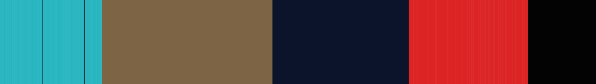

# Colorist

A Jellyfin plugin that samples colour across a video and renders it as a
vertical-stripe "movie barcode" — one stripe per moment, left to right through the
runtime — then shows it at the foot of the movie or episode page.



## What it does

- Samples frames across each movie and episode with ffmpeg
- Reduces every sampled frame to one representative colour
- Writes a PNG next to the media file, or to the plugin's data directory when the
  library is read-only
- Adds the strip to the bottom of the detail page in the web client

## Install

Add this repository to Jellyfin under **Dashboard → Plugins → Repositories**:

```
https://raw.githubusercontent.com/nitramivel/jellyfin-colorist/main/manifest.json
```

Then install **Colorist** from the catalogue and restart. Requires Jellyfin
**10.11.x**.

## Getting a barcode

Generation never happens inside a web request — a full library is potentially hours
of ffmpeg. Everything goes through the scheduled task:

- **Dashboard → Scheduled Tasks → Generate Barcodes**, or the button on the
  plugin's Run tab, which queues the same task
- The **Try one item** box on the Run tab builds a single barcode immediately, so
  you can see what an algorithm does before committing to a library run

Runs skip items that already have a barcode. After changing the colour algorithm or
the trims, turn on **Regenerate barcodes that already exist** or nothing will be
revisited.

## The colour algorithm

The interesting decision. Three implementations sit behind `IFrameColorStrategy`:

| Algorithm | What it does | When to use it |
|---|---|---|
| **Median cut** *(default)* | Groups colours into boxes in Oklab, splits along the longest axis, scores the boxes | Deterministic, non-iterative, fast enough for a whole library |
| **k-means** | k-means++ in Oklab, fixed seed | Better on graded footage — sunsets, heavy colour timing — at roughly 30× the cost |
| **Average** | The plain mean, in linear light | Comparison only. It goes brown |

Averaging goes brown for a reason no amount of care in the arithmetic fixes: a red
coat against green foliage genuinely averages to mud, because opposing hues cancel
through the neutral axis. The mean of two vivid colours is less colourful than
either. The alternatives cluster first and never average across a cluster boundary.

Everything runs in **Oklab** rather than RGB, because Euclidean distance in RGB does
not track perceived difference — clustering there merges colours a viewer calls
different and splits colours they call the same.

### The dominance exponent

Clusters are scored `population^e × chroma`, and `e` is exposed as a setting. This
is the "average versus dominant" question made continuous rather than binary:

- `0.0` — area is ignored; the most vivid patch wins, so one speck of lens flare
  decides the stripe
- `0.6` *(default)* — a small vivid subject beats a large grey wall, but a speck
  does not beat the subject
- `1.5`+ — area genuinely dominates, and a large dull background wins

Note `1.0` is **not** "largest area wins" — chroma still applies there.

## Sampling

**A fixed number of stripes, not a fixed interval.** The x-axis means *fraction of
runtime*, so a 22-minute episode and a 3-hour film produce comparable images that
cost about the same to make. A fixed interval would give the film eight times the
stripes and eight times the work.

**Keyframes only, by default.** `-skip_frame nokey` avoids reconstructing the frames
in between, which is where the cost is — often an order of magnitude. Keyframes also
tend to land on cuts, which is where colour changes. Sample times are read back from
ffmpeg's `showinfo` output and binned onto the stripes, so positions stay honest even
though keyframes are not evenly spaced.

**Letterboxing** is detected per item with `cropdetect`, probed a third of the way
into the file — never at the start, where a fade from black would suggest cropping
away the entire picture. The modal reading wins, and any crop discarding more than
40% of an axis is rejected as implausible.

**Credits** are trimmed as a percentage of runtime (0.5% head, 4% tail by default).
Deliberately blunt: black-run detection misfires on films that are genuinely dark,
and silently deleting the last eight minutes of one is worse than keeping some
credits.

## Where files go

`<video filename>-colorist.png`, beside the video — the movie folder for films, the
season folder for episodes. The `-colorist` suffix is not one Jellyfin's image
scanner recognises, so a barcode is never adopted as the item's poster or thumbnail.

If the folder cannot be written — a read-only bind mount, commonly — the image goes
to the plugin's data directory instead and still displays normally. The detail page
asks the API for it by item ID rather than guessing a path, so it never needs to know
which location was used.

## Not competing with playback

ffmpeg runs at below-normal process priority, so a viewer starting a transcode
mid-run takes CPU back rather than queueing behind the barcode job. Concurrency
defaults to a quarter of the processors, and decoder threads are capped per process.

Priority is used rather than pausing on active transcodes because Jellyfin 10.11
offers no way to ask: `ITranscodeManager` can look a job up by play session ID but
cannot enumerate them, and `ISessionManager` needs a user context a scheduled task
does not have. Handing the problem to the OS scheduler is both honest and better.

## API

| Endpoint | Auth | Purpose |
|---|---|---|
| `GET /Colorist/Barcode/{itemId}` | Any signed-in user | The PNG |
| `GET /Colorist/Barcode/{itemId}/Exists` | Any signed-in user | Whether one exists, without transferring it |
| `POST /Colorist/Generate` | Admin | Queue a full run |
| `POST /Colorist/Generate/{itemId}` | Admin | Build one item now |
| `DELETE /Colorist/Barcode/{itemId}` | Admin | Remove one |

The two `GET`s are deliberately not admin-only — every viewer's browser fetches them
to draw the strip, and requiring elevation would mean the feature only appears for
the owner.

## Building

```bash
export PATH="$HOME/.dotnet:$PATH"

dotnet build Jellyfin.Plugin.Colorist.sln -c Release
dotnet test  Jellyfin.Plugin.Colorist.sln -c Release
./build/package.sh
VERSION=0.1.0.0 CHANGELOG="..." ./build/release.sh
```

## Licence

MIT.
