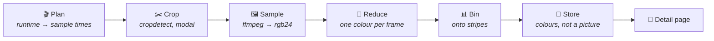

<div align="center">

# 🎨 Colorist

**A Jellyfin plugin that samples the colour of every film in your library —<br/>and draws it across the foot of the detail page.**

[](https://jellyfin.org)
[](https://dotnet.microsoft.com)
[](#-installation)

*One stripe per moment, left to right through the runtime.*

</div>


<div align="center"><i>Blade Runner 2049 (2017) — 2000 stripes, median cut, generated by this plugin</i></div>

---

Colorist is a scheduled task. It walks every movie and episode in your library, samples frames across each one with ffmpeg, reduces each sampled frame to the single colour that best represents it, and stores that sequence beside the media. The detail page draws it as a vertical-stripe barcode.

The result is a film's colour grade at a glance — the thing a poster cannot tell you.

> **Status:** running against a live Jellyfin 10.11.11 server. Generation, deletion, the live progress panel and the run history all work from the scheduled tasks or the configuration page.
>
> Still unverified: how the strip's selectors hold up across Jellyfin web client updates, since the detail page has no supported extension point.

## 🎯 Scope

Colorist does exactly one thing: **sample colour and draw a strip.**

It is not a general image-processing plugin and it does not manage artwork. It deliberately writes to a sidecar name Jellyfin's scanner ignores rather than setting any `ImageType`, so nothing it produces can be adopted as a poster or a thumbnail. Feature requests amounting to "also generate posters" are out of scope by design.

## 🧠 How it works



**1. Plan.** Each item gets a **fixed number of stripes, not a fixed interval**. The x-axis means *fraction of runtime*, so a 22-minute episode and a three-hour film produce comparable images that cost about the same to make. A fixed interval would give the film eight times the stripes and eight times the work.

**2. Crop.** Letterboxing is detected per item with `cropdetect`, probed a third of the way into the file — never at the start, where a fade from black would suggest cropping away the entire picture. The modal reading wins, and any crop discarding more than 40% of an axis is rejected as implausible.

**3. Sample.** **Keyframes only, by default.** `-skip_frame nokey` avoids reconstructing the frames in between, which is where the cost is — often an order of magnitude. Keyframes also tend to land on cuts, which is where colour changes. HDR and Dolby Vision are converted before their colours are measured; a PQ signal in BT.2020 read as though it were sRGB lands far too dark and collapses toward grey, which made every 4K HDR film produce a muted strip.

**4. Reduce.** Each frame becomes one colour. This is the interesting decision and it is [configurable](#the-colour-algorithm).

**5. Bin.** Sample times are read back from ffmpeg's `showinfo` output and binned onto the stripes, so positions stay honest even though keyframes are not evenly spaced.

**6. Store.** What lands on disk is the **measurement, not a picture** — see [Colours, not a picture](#-colours-not-a-picture).

Credits are trimmed as a percentage of runtime (0.5% head, 4% tail by default). Deliberately blunt: black-run detection misfires on films that are genuinely dark, and silently deleting the last eight minutes of one is worse than keeping some credits.

## ⚙️ Configuration

### The colour algorithm

Three implementations sit behind `IFrameColorStrategy`:

| Algorithm | What it does | When to use it |
|---|---|---|
| **Median cut** *(default)* | Groups colours into boxes in Oklab, splits along the longest axis, scores the boxes | Deterministic, non-iterative, fast enough for a whole library |
| **k-means** | k-means++ in Oklab, fixed seed | Better on graded footage — sunsets, heavy colour timing — at roughly 30× the cost |
| **Average** | The plain mean, in linear light | Comparison only. It goes brown |

Averaging goes brown for a reason no amount of care in the arithmetic fixes: a red coat against green foliage genuinely averages to mud, because opposing hues cancel through the neutral axis. The mean of two vivid colours is less colourful than either. The alternatives cluster first and never average across a cluster boundary.

Everything runs in **Oklab** rather than RGB, because Euclidean distance in RGB does not track perceived difference — clustering there merges colours a viewer calls different and splits colours they call the same.

| Colour setting | Description |
|---|---|
| **Dominance vs. vividness** | Clusters are scored `population^e × chroma`, and `e` is this setting. `0.0` ignores area entirely, so one speck of lens flare decides the stripe; `0.6` *(default)* lets a small vivid subject beat a large grey wall without letting a speck beat the subject; `1.5`+ lets a large dull background win. Note `1.0` is **not** "largest area wins" — chroma still applies |
| **Clusters per frame** | How many groups a frame is reduced to before one is chosen |
| **Black floor** | The level below which a pixel is treated as black and excluded |
| **Stripes per barcode** | How many stripes the runtime is divided into, 1000 by default |

### Sampling

| Sampling setting | Description |
|---|---|
| **Keyframes only** | On by default. Decoding every frame of a three-hour film to look at one in two hundred is work with nothing to show for it |
| **Letterboxing** | `None`, `Auto` *(default)*, or a `Fixed` crop applied to every item |
| **Tone map HDR** | On by default, and it matters more than it sounds — see step 3 above |
| **Skip at start / end** | Percentages of runtime, 0.5% and 4% by default |

### Output

| Output setting | Description |
|---|---|
| **Blend between stripes** | Fades one stripe into the next instead of hard edges. Blending is perceptual, so transitions do not pass through a dark seam. Takes effect on the next page load — nothing needs regenerating |
| **Store the barcode next to the media file** | On by default; falls back to the plugin's data directory when the folder is read-only |
| **Also write a PNG** | Off by default, and nothing in Jellyfin reads it — see [Colours, not a picture](#-colours-not-a-picture) |
| **Show the barcode at the foot of the detail page** | Whether the client script is injected at all |
| **Display height** | How tall the strip is drawn, in CSS pixels. It always spans the full width |

### Run

| Run setting | Description |
|---|---|
| **Include movies / episodes** | What a *generation* run builds. These deliberately do not gate deletion |
| **Regenerate barcodes that already exist** | Off by default, so a run picks up only what is new. Turn it on after changing the colour algorithm or the trims, or nothing will be revisited |
| **Share of the machine to use** | See [Not competing with playback](#-not-competing-with-playback) |
| **Items at once** | An explicit worker count that overrides the share outright. `0` uses the share |
| **ffmpeg threads** | Decoder threads per ffmpeg process; `1` by default |

## 🌈 Colours, not a picture

What gets stored is the measurement: one packed hex triplet per stripe, about 6 KB for the default thousand columns.

```json
{"v":1,"colors":"1a2b3c2f3d4e…"}
```

The strip on the detail page is drawn from that, in the browser. Stripe width, blending and display height are therefore decisions made at **draw time** — change any of them and the next page load shows the difference, where baking them into an image meant another pass of ffmpeg across the library. It also means the request carries a real `Authorization` header, which an `` cannot, so no access token has to travel in a URL.

Blended strips are interpolated perceptually by the browser — `linear-gradient(to right in oklab, …)` — rather than through the dark seam plain sRGB blending puts at every transition. Browsers predating that syntax fall back to a plain gradient.

Set **Also write a PNG** if you want `<video filename>-colorist.png` in the folder as well. Its size and blending are fixed at whatever they were when it was written. Turning it off removes the PNGs as items are regenerated.

> **Upgrading from 0.1:** barcodes made by that version are PNGs with no colour data behind them, and the colours cannot be recovered from a stretched, possibly blended image. Those items count as ungenerated and will be sampled again on the next run.

### Where files go

`<video filename>-colorist.json`, beside the video — the movie folder for films, the season folder for episodes. The `-colorist` suffix is not one Jellyfin's image scanner recognises, so nothing Colorist writes is ever adopted as the item's poster or thumbnail.

If the folder cannot be written — a read-only bind mount, commonly — the file goes to the plugin's data directory instead and the barcode still displays normally. The detail page asks the API for it by item ID rather than guessing a path, so it never needs to know which location was used.

## 📊 Watching a run

**Colorist → Run** shows a live progress panel while a run is going: what is being sampled right now, how far through it is, how many items a minute it is getting through, and how long is left. It polls every two seconds, served from the run's in-memory state rather than by re-reading a file.

The estimate is built from **throughput** — completions per wall-clock second over the last twenty — rather than from an average item duration, because items are sampled several at a time and a mean would overstate the answer by the concurrency factor. It is windowed because a library is not uniform: a run genuinely changes pace when it crosses from feature films into half-hour episodes. It is measured against the current moment rather than the last completion, so a run stalled on one enormous file shows a *growing* estimate instead of counting down through a hang. Nothing is shown until three items have finished; the first two are mostly startup cost.

Under it, **Recent runs** lists the last five, newest first by when each **started**. Open one to see every item it touched: the outcome, how long it took, how many frames were sampled and how many stripes those became, the crop that was applied, any HDR conversion, whether it landed beside the media or in the plugin's data directory, and the reason for anything that failed.

Runs are written to `<data>/colorist/runs/` and rotated at twenty. A run whose file still says `running` but which has no process behind it — a server restarted mid-run — is reported as **abandoned**, worked out when the file is read, because the one thing a process that has died cannot do is update its own file to say so.

### Deleting saved barcodes

**Colorist → Run → Delete saved barcodes**, or the **Delete Barcodes** scheduled task. It removes what Colorist has written from the library folders and from the plugin's data directory, across every movie and episode — including ones the include switches currently exclude, because a setting flipped afterwards should not decide what a delete is allowed to reach.

**Delete only the PNGs, keep the colour data** is on by default and is the safe choice: it clears out images an older version scattered through library folders while leaving the measurements that cost hours of ffmpeg. Clear it to remove everything and start over.

The button arms on the first click and fires on the second, saying which of the two it is about to do. Read-only folders are logged and skipped; the task reports how many files it actually removed rather than assuming. Orphaned sidecars beside media whose items have left the library are not reachable — finding those would mean walking every library folder looking for a filename pattern, and deleting files this plugin cannot tie back to anything Jellyfin still holds.

## 🚦 Not competing with playback

ffmpeg runs at **below-normal process priority**, so a viewer starting a transcode mid-run takes CPU back rather than queueing behind the barcode job.

**Share of the machine to use** sets how much of an idle server a run helps itself to, as a percentage of the processors Jellyfin can see — 25% by default. One ffmpeg runs per item and each is capped at one decoder thread, so items in flight is close to cores in use, which is what makes a percentage meaningful here. The page shows what it resolves to as you drag it: *"25% of 20 processors — 5 items at a time"*.

It is a budget, not a hard ceiling; the priority above is what holds the line under contention. Deliberately **not** processor affinity — pinning workers to fixed cores would stop the scheduler moving them out of a transcode's way, making playback worse in exactly the case the priority exists to protect. In a container the share is of the CPUs Jellyfin has been given rather than the host's, because .NET reports the cgroup quota.

Priority is used rather than pausing on active transcodes because Jellyfin 10.11 offers no way to ask: `ITranscodeManager` can look a job up by play session ID but cannot enumerate them, and `ISessionManager` needs a user context a scheduled task does not have. Handing the problem to the OS scheduler is both honest and better.

## 📦 Installation

### Prerequisites

1. A Jellyfin **10.11.x** server.
2. **ffmpeg and ffprobe**, which Jellyfin already ships and configures — Colorist uses the server's own paths, so if playback and thumbnails work, this does too.

### Install from the plugin catalogue (recommended)

1. In Jellyfin, go to **Dashboard → Plugins → Repositories** and add:

   ```
   https://raw.githubusercontent.com/nitramivel/jellyfin-colorist/main/manifest.json
   ```

2. Switch to the **Catalog** tab — Colorist now appears under General. Click it and press **Install**.
3. Restart Jellyfin when prompted.
4. Open Colorist's configuration page and check the settings, particularly **Share of the machine to use** on the Run tab.
5. Use **Try one item** on the Run tab with a single item ID to see what the colour algorithm does, then press **Generate for the whole library** for a first pass. Progress appears on the same tab.

### Install manually (folder drop)

1. Grab a packaged build — either from the repository's [releases](https://github.com/nitramivel/jellyfin-colorist/releases), or build one yourself (next section). Either way you end up with a folder containing `Jellyfin.Plugin.Colorist.dll` and `meta.json`.
2. Copy that folder into your server's plugin directory as `plugins/Colorist_<version>`:

   | Setup | Plugin directory |
   |---|---|
   | Podman/Docker (config dir mounted at `/config`) | `<your config mount>/plugins/Colorist_0.3.2.0/` |
   | Linux package | `/var/lib/jellyfin/plugins/Colorist_0.3.2.0/` |
   | Windows | `%ProgramData%\Jellyfin\Server\plugins\Colorist_0.3.2.0\` |

3. Make sure the files are readable by the Jellyfin user (for containers, match the UID the container runs as).
4. Restart Jellyfin. **Dashboard → Plugins** should now list Colorist as Active, then configure and run as in the catalogue steps above.

### Building from source

Requires the .NET 9 SDK.

```bash
git clone https://github.com/nitramivel/jellyfin-colorist
cd jellyfin-colorist
dotnet test Jellyfin.Plugin.Colorist.sln -c Release   # no network, no ffmpeg needed
./build/package.sh                                    # artifacts/Colorist_<version>/
```

`build/package.sh` accepts `VERSION` and `TARGET_ABI` environment variables if you need to pin either. Releasing a new catalogue version is `VERSION=x.y.z.w CHANGELOG="..." ./build/release.sh`, which builds the zip, computes its checksum, and updates `manifest.json` — then upload that exact zip to a GitHub release tagged `vx.y.z.w`.

## 🔌 API

| Endpoint | Auth | Purpose |
|---|---|---|
| `GET /Colorist/Barcode/{itemId}/Colors` | Any signed-in user | The colours — what the detail page draws |
| `GET /Colorist/Barcode/{itemId}` | Any signed-in user | The PNG, when one was written |
| `GET /Colorist/Barcode/{itemId}/Exists` | Any signed-in user | Whether one exists, without transferring it |
| `GET /Colorist/Version` | Admin | The running plugin version |
| `GET /Colorist/Status` | Admin | The live run, with progress and time left |
| `GET /Colorist/Runs?limit=5` | Admin | Recent run summaries, newest first |
| `GET /Colorist/Runs/{runId}` | Admin | One run in full, every item it touched |
| `POST /Colorist/Generate` | Admin | Queue a full run |
| `POST /Colorist/Generate/{itemId}` | Admin | Build one item now |
| `POST /Colorist/Delete` | Admin | Queue removal of every saved barcode |
| `DELETE /Colorist/Barcode/{itemId}` | Admin | Remove one, both files |

The item `GET`s are deliberately not admin-only — every viewer's browser fetches the colours to draw the strip, and requiring elevation would mean the feature only appears for the owner.

`/Colors` answers 404 for an item that has not been generated, so the detail page does not need `/Exists` first: one round trip per page instead of two. `/Exists` is kept for scripts checking on a library run, where transferring every item's colours to find out would be absurd.

## ⚠️ Caveats

- **The detail page has no supported extension point.** Jellyfin Web offers no API for adding to an item page, so the strip is injected by middleware and anchored with selectors taken from a real 10.11.11 server's stylesheet. Every lookup has a fallback and the script does nothing when they all miss, but a web client update can move it.
- **Some items come back as `Ineligible`.** Usually a container ffprobe cannot read, a codec ffmpeg refuses, a path unreachable at that moment, or no keyframes inside the trimmed window. The run log records the outcome but not yet the reason.
- **A first run over a large library is an all-night job.** That is ffmpeg's cost, not the plugin's. Start with the CPU share low if the server is also serving playback.
- **Sampling reads every file it touches.** On spinning disks or network storage the run may be I/O-bound long before it is CPU-bound, in which case raising the CPU share will not make it faster.
- **Barcodes do not update when a file is replaced.** Re-run with **Regenerate barcodes that already exist** after upgrading a release.

## 📄 Licence

MIT.
